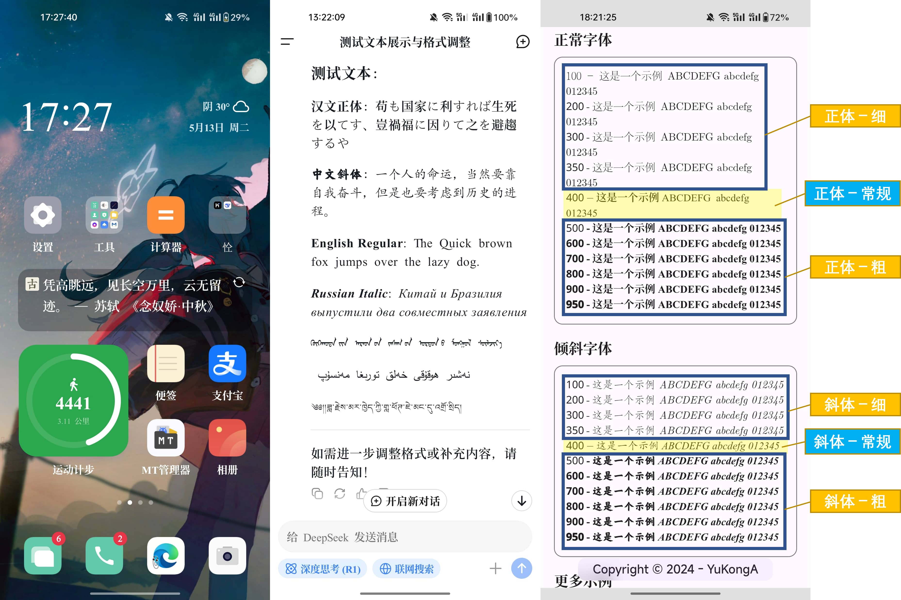
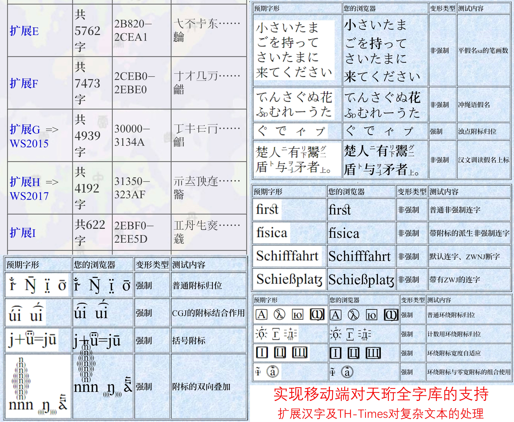

# ExptFont-MagiskModule 实验字库（Magisk模块）

## 模块简介

本模块修改自[LXGW的作品](https://github.com/lxgw/advanced-cjk-font-magisk-module-template)，旨在手机上实现[天珩全字库（TH-Tshyn）](http://cheonhyeong.com/Simplified/download.html)的开箱即用，同时也尽力平衡移动端文本阅读的美观性与功能性。  

演示：手机桌面、DeepSeek提供的测试文本、[@YuKongA](https://github.com/YuKongA/) 制作[字重测试页面](https://font.yukonga.top/)（本模块共设置细、常规、**粗**3档字重)  

测试：支持[天珩全字库（TH-Tshyn）](http://cheonhyeong.com/Simplified/download.html)的扩展字符显示及[TH-Times](http://cheonhyeong.com/Tools/Times.html)对复杂文本的正确处理。

---

## 字库组合方案

<table>
  <thead>
    <tr>
      <th>类型、字重</th>
      <th>选用</th>
      <th>备注</th>
      <th>文件位置</th>
    </tr>
  </thead>
  <tbody>
    <tr>
      <td>中文正体-常规</td>
      <td>
        <a href="https://github.com/notofonts/noto-cjk">思源宋体（SemiBold字重）</a>v2.003
      </td>
      <td><strong>中文字形主体风格</strong>，SemiBold起手，看起来超爽。</td>
        <td><code>ExptFont/system/fonts/fontchw4.otf</code></td>
    </tr>
    <tr>
      <td><strong>中文正体-粗</strong></td>
      <td>
        <a href="https://github.com/notofonts/noto-cjk">思源宋体（Blold字重）</a>v2.003
      </td>
      <td>类似<a href="https://www.foundertype.com/index.php/FontInfo/index/id/164">小标宋</a>的字重。</td>
      <td><code>ExptFont/system/fonts/fontchw5.otf</code></td>
    </tr>
    <tr>
      <td>中文正体-细</td>
      <td>宋一体</td>
      <td>
        <a href="http://printinginst.com/newsinfo/2222180.html">相关历史文化</a>。
      </td>
      <td><code>ExptFont/system/fonts/fontchw3.ttf</code></td>
    </tr>
    <tr>
        <td><em>中文斜体-常规</em></td>
      <td>正文楷</td>
      <td rowspan=2>所谓“斜体”（italic）脱胎于西文手写体，对中文而言，使用楷体再合适不过。</td>
      <td><code>ExptFont/system/fonts/fontciw4.ttf</code></td>
    </tr>
    <tr>
      <td><em><strong>中文斜体-粗</strong></em></td>
      <td>榜书楷</td>
      <td><code>ExptFont/system/fonts/fontciw5.ttf</code></td>
    </tr>
    <tr>
      <td><em>中文斜体-细</em></td>
      <td>仿宋体</td>
      <td>增大视觉差异度。</td>
      <td><code>ExptFont/system/fonts/fontciw3.ttf</code></td>
    </tr>
    <tr>
      <td>Latin-Normal-Regular</td>
      <td>
        <a href="http://cheonhyeong.com/Tools/Times.html">天珩泰晤士报体（TH-Times）</a>v8.01
      </td>
      <td><strong>西文字形主体风格</strong>，同时保证各类复杂文种正常显示。字体信息详见<a href="http://cheonhyeong.com/Tools/Times.html">说明文档</a>。</td>
      <td><code>ExptFont/system/fonts/fontenw4.ttc</code></td>
    </tr>
    <tr>
      <td>
        <strong>Latin-Normal-Bold</strong>; 
        <em>-Italic-Regular; <strong>Bold</strong></em>
      </td>
      <td>泰晤士报新罗马体（<em>Times</em> <strong>New</strong> Roman）</td>
      <td rowspan=2>久经考验的。</td>
      <td><code>ExptFont/system/fonts/fontenw5.ttf</code>; <code>fonteiw4.ttf</code>; <code>fonteiw5.ttf</code></td>
    </tr>
    <tr>
      <td>
        Latin-Normal-Light; 
        <em>-Italic-Light</em>
      </td>
      <td>
        <a href="https://ctan.org/pkg/cm-unicode">计算机现代体-统一码版（Computer Modern-Unicode）</a>v0.7.0
      </td>
      <td><code>ExptFont/system/fonts/fontenw3.ttf</code>; <code>fonteiw3.ttf</code></td>
    </tr>
    <tr>
      <td>扩展字符支持</td>
      <td>
        <a href="http://cheonhyeong.com/Simplified/download.html">天珩全字库（TH-Tshyn）v4.1.0</a>
      </td>
      <td><strong>用于fallback</strong>，覆盖<a href="https://www.unicode.org/versions/Unicode16.0.0/">Unicode®16.0</a>全部字符（包括所有扩展汉字）。</td>
      <td><code>ExptFont/system/fonts/fontenw4.ttc</code>; <code>TH-Tshyn-P0.ttf</code>; <code>TH-Tshyn-P1.ttf</code>; <code>TH-Tshyn-P2.ttf</code>; <code>TH-Tshyn-P16.ttf</code></td>
    </tr>
  </tbody>
</table>

---

## 安装说明

0. 确定爱机装有“救砖模块”，且已做好数据备份。
1. 在[Releases](https://github.com/Fisher4124/ExptFont-MagiskModule/releases)页面下载`ExptFont.zip` (或自行打包)，[百度网盘 (提取码0etm)](https://pan.baidu.com/s/1baPLW8VUTA3d4I1yQ3fbOw)。
2. Magisk，启动！ → 右下角【模块】 → 上部【从本地安装】。
3. 刷入后重启设备。

---

应许之作。